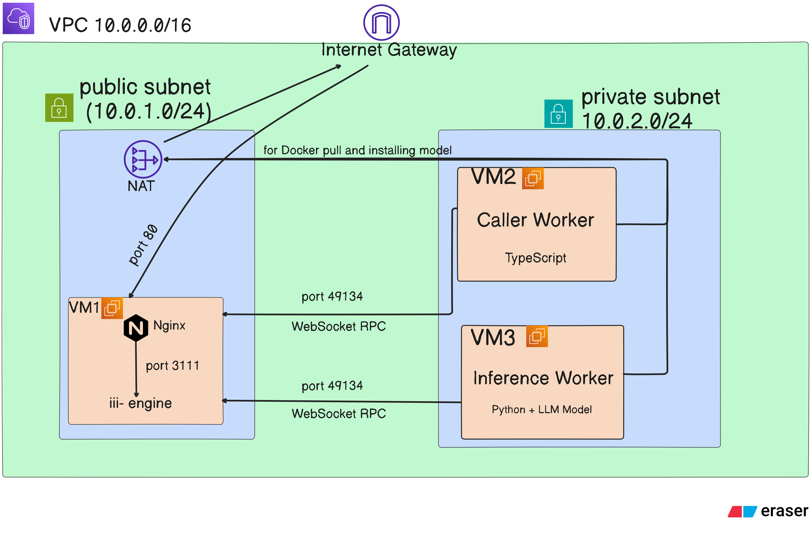
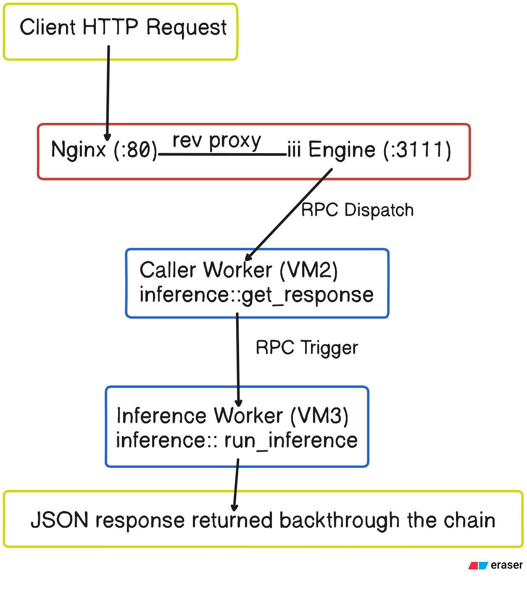

# Distributed Inference System - DevOps Assignment

A production-grade deployment of a distributed SLM (Small Language Model) inference system across multiple AWS EC2 instances. The system runs a **Qwen3-0.6B** model behind a worker mesh orchestrated by the [iii framework](https://iii.dev), exposed as a JSON HTTP API through an Nginx reverse proxy.

## Architecture



### Request Flow




### Component Overview

| Component            | VM  | Subnet  | Language    | Function                                           |
| -------------------- | --- | ------- | ----------- | -------------------------------------------------- |
| **iii Engine**       | VM1 | Public  | Rust binary | Orchestrates workers, serves HTTP API              |
| **Nginx**            | VM1 | Public  | —           | Reverse proxy with rate limiting, security headers |
| **Caller Worker**    | VM2 | Private | TypeScript  | Routes HTTP requests → inference RPC calls         |
| **Inference Worker** | VM3 | Private | Python      | Loads Qwen3-0.6B model, runs inference             |


### Network Setup
- The project runs across three virtual machines hosted on AWS in the Mumbai region (ap-south-1). To keep things secure and organized, all three VMs live inside a dedicated private network (iii-vpc) that is completely isolated from everything else on AWS.
- VM-1 (the API gateway) sits in a public subnet - it's the only machine directly reachable from the internet. It handles incoming HTTP requests on port 80 and communicates with the worker VMs internally over WebSocket on port 49134.
- VM-2 and VM-3 (the workers) sit in a private subnet - they have no public IP and cannot be accessed directly from the internet. They can only be reached from within the VPC, specifically from VM-1. This ensures the workers are never exposed externally.
- Even though the workers are private, they still need outbound internet access to do things like download the model or install packages during setup. This is handled by a NAT Gateway sitting in the public subnet - it lets private VMs initiate outbound connections to the internet, while blocking any unsolicited inbound traffic from reaching them.
- SSH access is also locked down by design - VM-1 can be SSHed into directly from your local machine, and VM-2/VM-3 can only be SSHed into by going through VM-1 (acting as a jump/bastion host).

### Network Security

- **VM1** is the only public-facing instance (port 80 HTTP, port 22 SSH from admin IP)
- **VM2/VM3** are in a private subnet — **NOT reachable from the internet**
- Workers connect to the engine via WebSocket RPC over the VPC private network (`ws://10.0.1.x:49134`)
- NAT Gateway provides outbound-only internet access for VM2/VM3 (docker pull, apt-get)

---

## API Documentation

### Health Check

```bash
curl http://<PUBLIC_IP>/health
```

```json
{ "status": "ok" }
```

### Run Inference

```bash
curl -X POST http://<PUBLIC_IP>/v1/chat/completions \
  -H "Content-Type: application/json" \
  -d '{
    "messages": [
      {"role": "user", "content": "Explain quantum entanglement in simple terms."}
    ]
  }'
```

**Response:**

```json
{
  "result": {
    "response": "Quantum entanglement is a phenomenon where two particles become linked...",
    "success": "You've connected two workers and they're interoperating seamlessly..."
  }
}
```

### Request Schema

| Field                | Type   | Required | Description                               |
| -------------------- | ------ | -------- | ----------------------------------------- |
| `messages`           | Array  | Yes      | Chat messages in OpenAI-compatible format |
| `messages[].role`    | String | Yes      | `"user"`, `"assistant"`, or `"system"`    |
| `messages[].content` | String | Yes      | Message content                           |

---

## Deployment

### Prerequisites

- AWS account with credentials configured (`aws configure`)
- [Terraform](https://developer.hashicorp.com/terraform/install) >= 1.5
- [Docker](https://get.docker.com) (for building images locally)
- An EC2 key pair created in `ap-south-1`

### Deploy from Scratch

```bash
# 1. Clone the repo
git clone https://github.com/faizanfirdousi/alchemyst-assign.git
cd alchemyst-assign

# 2. Configure Terraform
cd terraform
cp terraform.tfvars.example terraform.tfvars
# Edit terraform.tfvars:
#   key_name = "your-ec2-keypair"
#   my_ip    = "YOUR_PUBLIC_IP/32"    ← run: curl -s ifconfig.me

# 3. Deploy
terraform init
terraform plan     # Review what will be created
terraform apply    # Create everything (~3-5 minutes)

# 4. Wait ~2-3 minutes for user-data scripts to complete, then test:
curl http://$(terraform output -raw api_gateway_public_ip)/health
curl -X POST http://$(terraform output -raw api_gateway_public_ip)/v1/chat/completions \
  -H "Content-Type: application/json" \
  -d '{"messages":[{"role":"user","content":"Hello!"}]}'

# 5. Tear down when done
terraform destroy
```

### What Terraform Creates

| Resource         | Count | Purpose                                              |
| ---------------- | ----- | ---------------------------------------------------- |
| VPC              | 1     | Isolated network (`10.0.0.0/16`)                     |
| Public Subnet    | 1     | Hosts VM1 (`10.0.1.0/24`)                            |
| Private Subnet   | 1     | Hosts VM2, VM3 (`10.0.2.0/24`)                       |
| Internet Gateway | 1     | Public subnet → internet                             |
| NAT Gateway      | 1     | Private subnet → internet (outbound only)            |
| Security Groups  | 2     | API gateway (public) + Workers (private)             |
| EC2 Instances    | 3     | VM1 (t3.small), VM2 (t3.small), VM3 (c7i-flex.large) |

---

## Docker Images

All services are containerized and pre-built on Docker Hub:

| Image                                 | Size   | Contents                                       |
| ------------------------------------- | ------ | ---------------------------------------------- |
| `faizanfirdousi/iii-engine`           | 258 MB | iii engine binary + config                     |
| `faizanfirdousi/iii-caller-worker`    | 305 MB | Node.js 20 + TypeScript worker                 |
| `faizanfirdousi/iii-inference-worker` | 2.1 GB | Python 3.11 + PyTorch (CPU) + Qwen3-0.6B model |

Images are **automatically rebuilt and pushed** by GitHub Actions when source code changes on `main` (see CI/CD below).

### Rebuild Images Manually (optional)

```bash
# From the repo root
docker build -f docker/engine/Dockerfile -t faizanfirdousi/iii-engine:latest .
docker build -f docker/caller-worker/Dockerfile -t faizanfirdousi/iii-caller-worker:latest .
docker build -f docker/inference-worker/Dockerfile -t faizanfirdousi/iii-inference-worker:latest .

docker push faizanfirdousi/iii-engine:latest
docker push faizanfirdousi/iii-caller-worker:latest
docker push faizanfirdousi/iii-inference-worker:latest
```

---

## Continuous Integration

A GitHub Actions workflow handles the **CI pipeline** — automatically rebuilding and pushing Docker images whenever source code changes are pushed to `main`. The key design choice is **selective rebuilding** — instead of rebuilding all three images on every push, the pipeline detects which files changed and only rebuilds the image(s) that are actually affected.

### Pipeline Flow

```
Push to main
    │
    ▼
Detect changed files (dorny/paths-filter)
    │
    ├── workers/caller-worker/** changed?  → rebuild iii-caller-worker
    ├── workers/inference-worker/** changed? → rebuild iii-inference-worker
    └── config.yaml / iii.lock changed?     → rebuild iii-engine
    │
    ▼
Build with Docker Buildx + GitHub Actions layer cache
    │
    ▼
Push updated image(s) to Docker Hub
```

### How It Works

1. **Trigger** — The workflow runs only when a push to `main` modifies files under `workers/`, `docker/`, `config.yaml`, `iii.lock`, or `.iii/`. Changes to Terraform, docs, or the README do **not** trigger a build.

2. **Change detection** — Uses [dorny/paths-filter](https://github.com/dorny/paths-filter) to compare the diff against path patterns for each image. This avoids wasting ~3 minutes rebuilding the 2.1 GB inference worker image when only the caller worker code changed.

3. **Build & push** — Each image is built conditionally using `docker/build-push-action` with GitHub Actions cache (`type=gha`), so unchanged Docker layers are reused across runs.

### Setup

Add two repository secrets under **Settings → Secrets and variables → Actions**:

| Secret | Description |
| --- | --- |
| `DOCKERHUB_USERNAME` | Docker Hub username |
| `DOCKERHUB_TOKEN` | Docker Hub [Personal Access Token](https://app.docker.com/settings) (Read & Write) |

---

## Repository Structure

```
.
├── .github/workflows/
│   └── docker-publish.yml      # CI/CD: auto-build images on push
├── config.yaml                 # iii engine configuration
├── iii.lock                    # Worker version lock
├── workers/
│   ├── caller-worker/          # TypeScript — routes HTTP → RPC
│   │   ├── src/worker.ts
│   │   └── package.json
│   └── inference-worker/       # Python — runs Qwen3-0.6B model
│       ├── inference_worker.py
│       └── requirements.txt
├── docker/
│   ├── engine/
│   │   ├── Dockerfile          # iii engine container
│   │   └── nginx.conf          # Nginx: rate limiting, security headers, health check
│   ├── caller-worker/
│   │   └── Dockerfile          # Node.js 20 container
│   └── inference-worker/
│       └── Dockerfile          # Python 3.11 + model pre-downloaded
├── docker-compose.vm1.yml      # VM1: engine + nginx (public subnet)
├── docker-compose.vm2.yml      # VM2: caller worker (private subnet)
├── docker-compose.vm3.yml      # VM3: inference worker (private subnet)
├── terraform/
│   ├── main.tf                 # Provider + AMI data source
│   ├── variables.tf            # Configurable inputs
│   ├── vpc.tf                  # VPC, subnets, IGW, NAT, route tables
│   ├── security_groups.tf      # Firewall rules
│   ├── ec2.tf                  # 3 EC2 instances + user-data
│   ├── outputs.tf              # Public IP + curl commands
│   ├── terraform.tfvars.example
│   └── user-data/
│       ├── vm1.sh.tpl          # VM1 bootstrap (15 lines)
│       └── worker.sh.tpl       # VM2/VM3 bootstrap (ENGINE_IP injected)
└── README.md
```

---

## Production Hardening

- **HTTPS** — ALB + ACM certificate or Let's Encrypt on Nginx. All traffic is currently unencrypted HTTP.
- **Auth** — API key or JWT on the inference endpoint; currently open to anyone.
- **Secrets** — Move sensitive config from env vars to AWS Secrets Manager / SSM Parameter Store.
- **Observability** — Ship logs to CloudWatch via Fluent Bit; add Prometheus + Grafana for latency and error-rate dashboards (iii already exposes OpenTelemetry).
- **Instance resilience** — Wrap each EC2 in an ASG (min=1) so failed instances are auto-replaced; move the engine's `state_store.db` to an EBS volume.

---

## Scaling to 100x Larger Models

For a 60B-parameter model (~120 GB in FP16):

- **GPU instances** — `p4d.24xlarge` (8× A100 80 GB) with tensor parallelism; serve via vLLM or TGI for batched inference.
- **Quantization** — 4-bit GPTQ/AWQ cuts VRAM to ~30 GB, fitting on a single A100.
- **Async queue** — Replace synchronous RPC with SQS/Redis; clients submit and poll, decoupling the API tier from 10-30 s inference latency.
- **Model storage** — Keep weights on EFS instead of baking a 120 GB Docker image; workers pull at boot.
- **Autoscaling** — EKS + KEDA for GPU-aware scaling by queue depth; Spot Instances for burst capacity at 60-90 % discount.
